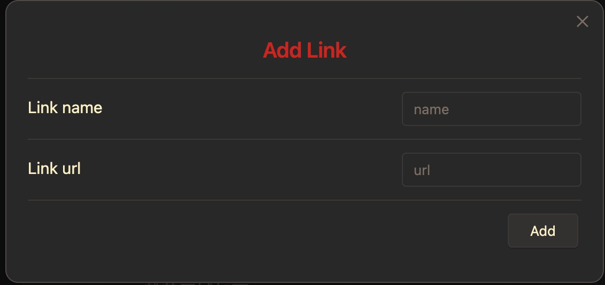
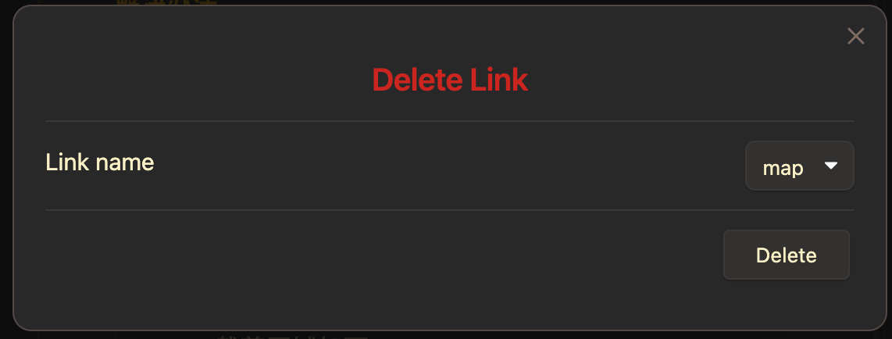
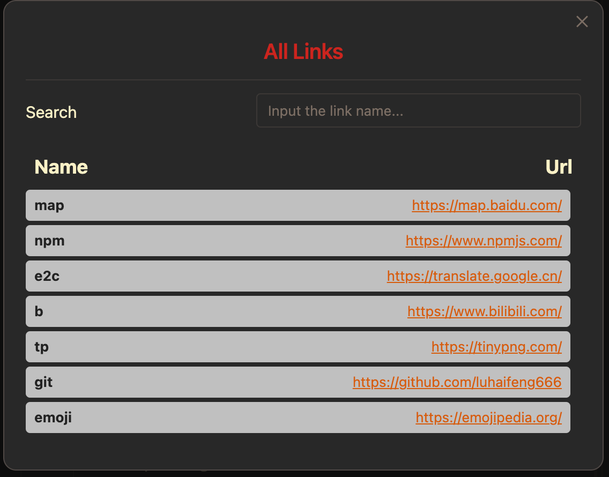

<h1 align="center"> obsidian-translator </h1>

<p align="center">
  
  
</p>

<p align="center"> This is a plugin for Obsidian to manage your frequently used links. </p>


## Install

### Prerequisites

To install this plugin, you will need:

- [Git](https://git-scm.com/) installed on your local machine.
- A GitHub account.
- A local development environment for Node.js and the Node.js version should be above **14.17.0**.
- The [Obsidian](https://obsidian.md/) App.

### Step 1: Download the plugin

Download the [source code](https://github.com/luhaifeng666/obsidian-link-keeper) into the plugins folder.

```
git clone git@github.com:luhaifeng666/obsidian-link-keeper.git
```

### Step2: Build the plugin

1. Navigate into the plugins folder:

```
cd path/to/vault/.obsidian/plugins/obsidian-link-keeper
```

2. Install dependencies:

```
pnpm run install
```

3. Build the plugin:

```
pnpm run build
```

### Step 3: Enable the plugin

To load the plugin in Obsidian, you first need to enable it.

1. Open **Preferences** in Obsidain.
2. In the side menu, click **Community plugins**.
3. Under **Installed plugins**, enable the **Link keeper** plugin by clicking the toggle button next to it.

You are now running the obsidian-link-keeper plugin! Nice~🎉

## Settings

You can set the file path where the links are stored by following steps.

- Open **Preferences** in Obsidian.
- In the side menu, click **Link keeper**.
- Fill in the file path into the text box. The default file path is **`${process.env.HOME}/etl.json`**

## Usage

You can manage the links through this plugin.

### Add link

You can add a link by following steps.

- Click the command icon in the left side menu.
- Select a command named **Link keeper: Add link**.
- Fill in the link name and the link url and save them by clicking the **add button**.



> 💡 **By the way** <br>
> If you find it troublesome or you wanna add the link selected in the Obsidian editor, you can try following steps.
>
> - Select the link you wanna add.
> - Open modal by the above three steps or the [**hotkey**](#set-hotkeys).
> - Fill in the link name and click the **add button** to save.

### Delete link by link name

You can delete a link by following steps.

- Click the command icon in the left side menu.
- Select a command named **Link keeper: Delete link**.
- Select a link name and click the **delete button**.



### Search link by link name

You can search a link by following steps.

- Click the command icon in the left side menu.
- Select a command named **Link keeper: List link**.
- Fill in the link name.



### Set hotkeys

You can set hotkeys for the above commands.

- Open **Preferences** in Obsidian.
- Click the **Community plugins** in the side menu.
- Click the **Hotkeys icon** next to the information of the **Link keeper** plugin.
